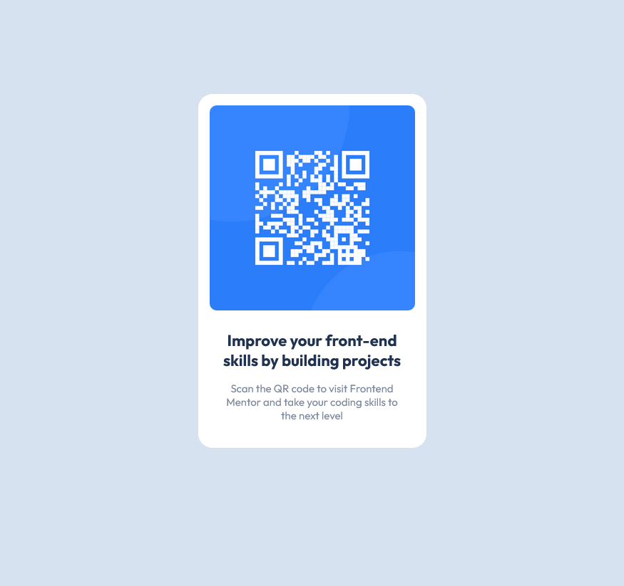

# Frontend Mentor - QR code component solution

This is a solution to the [QR code component challenge on Frontend Mentor](https://www.frontendmentor.io/challenges/qr-code-component-iux_sIO_H). Frontend Mentor challenges help you improve your coding skills by building realistic projects. 

## Table of contents

- [Overview](#overview)
  - [Screenshot](#screenshot)
  - [Links](#links)
- [My process](#my-process)
  - [Built with](#built-with)
- [Author](#author)

## Overview

### Screenshot

### Links

- [Solution](https://github.com/stefankarlsson1230/FrontendMentor-Newbie-Qr-code-component)
- [Live Site](https://stefankarlsson1230.github.io/FrontendMentor-Newbie-Qr-code-component/)

## My process

### Built with

- HTML and CSS with a pinch of Flexbox

## Author

- Frontend Mentor - [@stefankarlsson1230](https://www.frontendmentor.io/profile/stefankarlsson1230)

